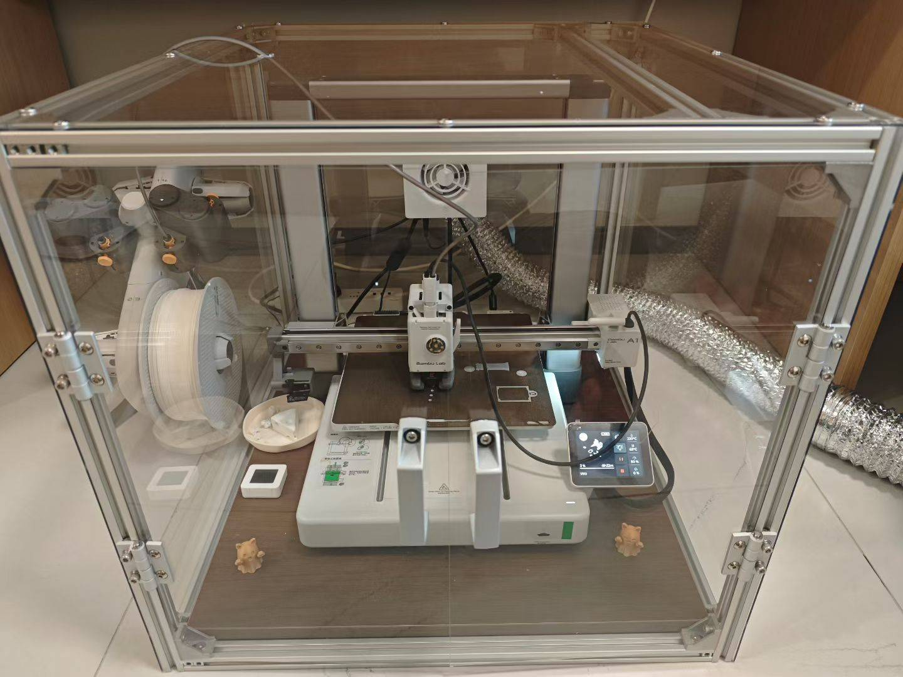

# 拓竹A1封箱套件
为拓竹A1 3D打印机设计的全包围封箱解决方案

## 功能
- 隔音降噪：有效降低3D打印时产生的噪音
- 空气净化：排风系统，排出打印过程中的有害气体
- 美观实用：简洁现代的外观设计
- 远程监控：支持摄像头安装，便于远程监控打印进度

## 材料清单

| 序号 | 材料名称 | 数量 | 规格参数 | 单价(元) | 购买链接 |
|------|----------|------|----------|----------|----------|
| 1 | 铝合金把手 | 2 | 2020型 90mm | ¥2.85 | [购买链接](https://item.taobao.com/item.htm?id=846974307042&mi_id=0000YU2LqFPyJ42caAGfWLdDwvU9GGCmnAypC6gsDCPaj2M&spm=tbpc.boughtlist.suborder_itemtitle.1.beba2e8dYDU0v1) |
| 2 | 铝合金铰链 | 4 | 2020型 长孔距20×40mm | ¥3.6 | [购买链接](https://item.taobao.com/item.htm?id=923896757346&mi_id=0000G-rZWJ4Jkgp8MYQmS4SgunJdW0O6iKIR4QCbxuq2jjc&spm=tbpc.boughtlist.suborder_itemtitle.1.beba2e8dYDU0v1) |
| 3 | 弹珠螺母 | 50 | 欧标-20型M5 | ¥1.9(10个装) | [购买链接](https://item.taobao.com/item.htm?id=817198046752&mi_id=0000RjABuYusmIBUuFkI7gOuvIWb-y1om0okfYYfl8Bk0RA&spm=tbpc.boughtlist.suborder_itemtitle.1.beba2e8dYDU0v1) |
| 4 | 可调速排气风扇 | 1 | 75mm | ¥77 | [购买链接](https://item.taobao.com/item.htm?id=666163117000&mi_id=0000x6egclDT0cTcyFGNZ6RIVNJu_zYbfYw16u1Ms5YnzY0&spm=tbpc.boughtlist.suborder_itemtitle.1.beba2e8dYDU0v1) |
| 5 | 铝箔排气管 | 1 | 1.5m长 75mm内径 | ¥9.6 | [购买链接](https://item.taobao.com/item.htm?id=663151281509&mi_id=0000LWiGUTW2gOGOt1Z-jMPBxZ1g9Z10kQGum1m3xztgYns&spm=tbpc.boughtlist.suborder_itemtitle.1.beba2e8dYDU0v1) |
| 6 | 数显温湿度计 | 1 | 普通 | ¥3.99 | [购买链接](https://item.taobao.com/item.htm?id=986103574539&mi_id=00007pAwpmDgOUc3v29ltoNx2gH7rdd_19IcT4cdEyquleg&spm=tbpc.boughtlist.suborder_itemtitle.1.beba2e8dYDU0v1&skuId=5950439433767) |
| 7 | 胡桃木装饰板 | 1 | 500mm×560mm | ¥51 | [购买链接](https://detail.tmall.com/item.htm?id=862889574219&mi_id=00003j3_u3QjWIxqbhEiWRF7mZoyYubGRvzObo8ckmKoWPI&spm=tbpc.boughtlist.suborder_itemtitle.1.beba2e8dYDU0v1) |
| 8 | 透明亚克力板 | 1套 | CAD图定制 2mm厚 | ¥95 | [购买链接](https://item.taobao.com/item.htm?id=651631113540&mi_id=0000fu2KU7kW6CBXDvRVkwf0vqCLs09LhzQSTG-AI_W8N-8&spm=tbpc.boughtlist.suborder_itemtitle.1.beba2e8dYDU0v1) |
| 9 | 铝箔胶带 | 1 | 5cm宽 防火型 | ¥7.85 | [购买链接](https://detail.tmall.com/item.htm?id=629675739669&mi_id=0000spK09z7P9j6S6NRyRsvGT4yH9GLDD2DMSWnWEBkJFUU&spm=tbpc.boughtlist.suborder_itemtitle.1.beba2e8dYDU0v1) |
| 10 | 2020铝型材 | 1套 | 500mmx8 520mmx4 | ¥75 | [购买链接](https://www.jlcfa.com/search?q=2020&t=1761567953960&spm=fa-pc.homepage.search) |
| 11 | 外置角码 | 30个 | 欧标2020 | ¥1.42 | [购买链接](https://www.jlcfa.com/search?q=2020&t=1761567953960&spm=fa-pc.homepage.search) |

## 安装指南
1. **框架搭建**: 使用铝型材和弹珠螺母构建主体框架
2. **面板安装**: 将亚克力板固定到框架上形成封闭空间
3. **硬件安装**: 安装铰链、把手、排气扇等配件
4. **装饰处理**: 安装胡桃木装饰板提升外观质感
5. **功能调试**: 测试通风系统和监控设备

## 效果展示
| 静态时  | 运行时 |
|:---:|:---:|
|  |  |

## 注意事项
- 组装前请仔细核对所有零件
- 确保通风系统连接正确，保障打印安全
- 定期清洁过滤装置，维护良好的工作环境

## 许可证
本项目遵循 [MIT License](LICENSE)。
